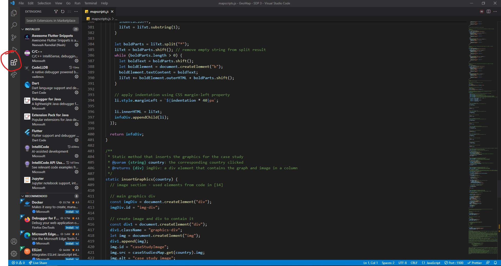
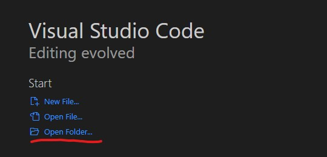
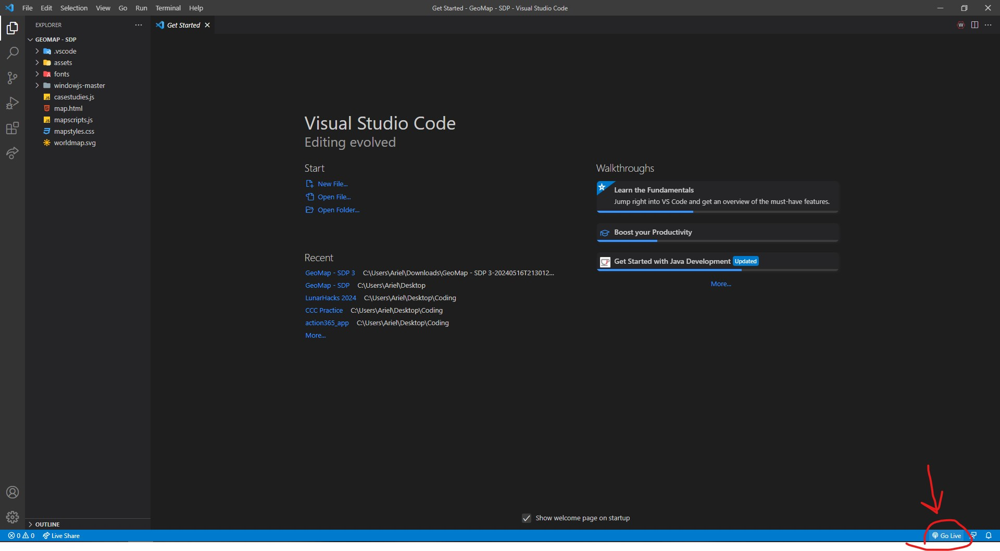
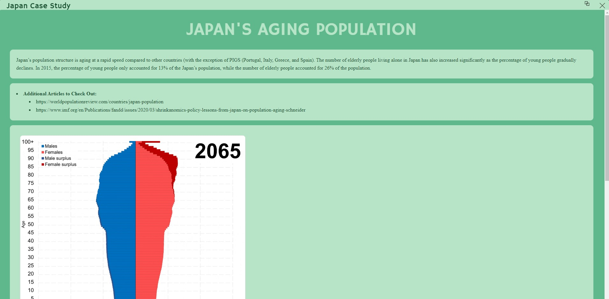
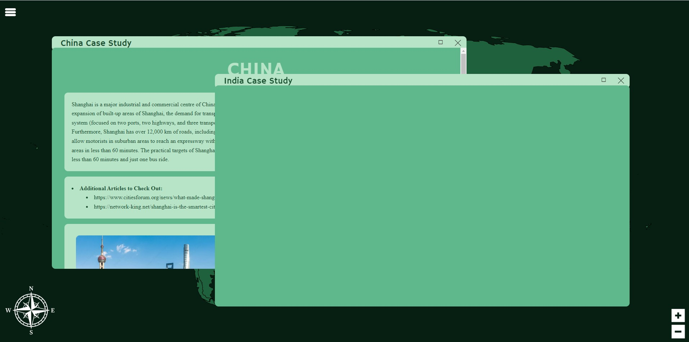
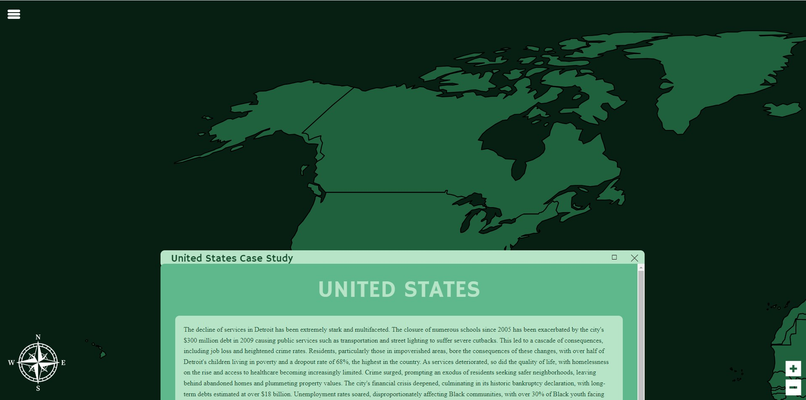
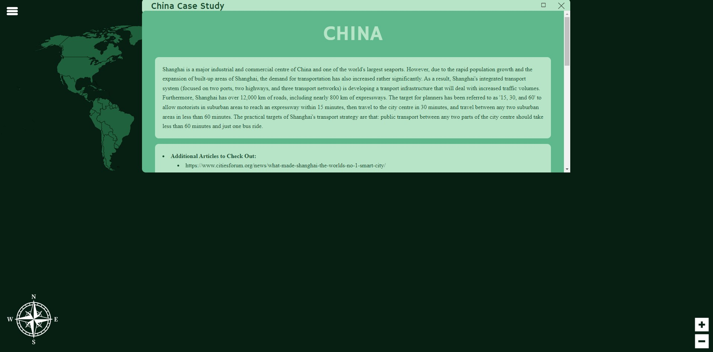

# GeoMap

GeoMap is an interactive digital map web app aligned with the IB Geography curriculum at Merivale High School. It aims to enhance the understanding of case studies by allowing students to access and review information in different areas of the map, and interact with study material, images, and graphics.

## Features

- **Interactive Map and Case Study Windows**: View geographic regions and their case study data and information. Open, close, maximize windows with information as needed.
- **Legend**: Color-coordinated areas on the map based on subject area (different IB Geography units - Urban Environments, Global Climate, Changing Populations, etc.).
- **Search/Filter Function**: See case studies from specific subject areas only based on color, after checking off the desired boxes on Legend.
- **Variety of Statistical Data, Diagrams, Graphs**: Interactive elements in case studies that would help students have a better understanding of geography concepts, terms, and information.
- **Three Units of Focus**: Prioritized units and study material within the IB Geography syllabus - Core 1 (Changing Populations), Core 2 (Climate Change), Option G (Urban Environments), and Option F (Food and Health).

The product demo video can be viewed [here](https://youtu.be/QDQctfU7flc).

## Installation

Installation of the code editor [Visual Studio Code](https://code.visualstudio.com/) is required to access GeoMap.

Unfortunately, in its current phase of development, GeoMap can only be hosted locally and accessed through the code itself. As a result, it is advisable to be careful and not modify the existing code. The following steps will allow for the best user experience.

### Download

Download all GeoMap files. There should be one main folder with everything inside titled "GeoMap - SDP". Extract all files if they were downloaded as a zip.

### Open in Visual Studio Code

Install the code editor [Visual Studio Code](https://code.visualstudio.com/). Please refer to the [official documentation](https://code.visualstudio.com/docs) for help installing.

### Installing Extensions

Open Visual Studio Code. Navigate to "Extensions".



Install [**Live Server**](https://marketplace.visualstudio.com/items?itemName=ritwickdey.LiveServer).


Learn more about extensions in Visual Studio Code [here](https://code.visualstudio.com/docs/editor/extension-marketplace).

### Open the GeoMap folder

In the home page of Visual Studio Code, click "Open Folder...".



Select and open the extracted folder "GeoMap - SDP" from your files.

### Access GeoMap through Live Server

In the bottom right corner, click **Go Live**.



In the page that comes up in your browser, click the **map.html** file.

You are now able to access GeoMap!

## Modifying Case Study Information

The process of modifying case study information is slightly meticulous, but simple once the administrator practices it a few times.

### Adding new countries

Access the **casestudies.js** file. Create a new case study class.

```
const CanadaExampleCaseStudy = new CaseStudy(unit, name, info, quickfacts, img, graph)
```

Add the desired information within the class, as class fields. See more about modifying the case study attributes for custom information [here](#adding-information-with-the-casestudy-class)

At the bottom of the file, in the Javascript map called caseStudiesMap, add the new case study created, and the country it corresponds to. The key in the map should be a string object of the country (ex. "Canada"), and the second item should be the name of the case study created earlier (ex. CanadaExampleCaseStudy).

```
const caseStudiesMap = new Map([
  ["Canada", CanadaExampleCaseStudy],
]);
```

Finally, in **map.html**, add the country corresponding to the case study in the list "countryList" on line 1219.

```
countryList = ["Canada"]
```

Make sure to capitalize the country properly.

### Adding Information with the CaseStudy Class

The information in each case study can be customized when creating the class, and modifying the attributes when creating it.

| Attribute  | Type | Description                                                                                                                                                                                                     |
| ---------- | ---- | --------------------------------------------------------------------------------------------------------------------------------------------------------------------------------------------------------------- |
| unit       | str  | The unit that the case study corresponds to. Options are: “Changing Populations”, “Urban Environments”, “Global Climate”, “Food and Health”.                                                                    |
| name       | str  | The name of the case study. Ex) Barcelona Deprivation                                                                                                                                                           |
| info       | list | A list of the info that is to be displayed in the first box of the case study.                                                                                                                                  |
| quickfacts | list | A list of the bullet points of short facts that is to be displayed in the second box of the case study. See more on how to modify "quickfacts" attribute [here](#modifying-bullet-points-in-case-study-windows) |
| img        | str  | The image source that should be associated with the case study (optional).                                                                                                                                      |
| graph      | str  | The source link for the interactive graph or iframe element that should be associated with the case study (optional).                                                                                           |

### Modifying Bullet Points in Case Study Windows

The information that is displayed in the case studies can be modified with specific formatting with the string input.

#### Bolding Text

It is possible to bold text using two asterisks on either side of the text.

#### New Lines and indents

New lines to be displayed as bullet points should be separated with the "@" symbol. No space is necessary between the words. New lines with an indent should additionally have an "^" symbol along with the "@" symbol.

Note that the very first line of the bullet point does not need an "@" symbol in front of it.

An example below is provided to help guide the creation of this field in the case study.

This attribute is designed to be a list, where the chosen display can be modified. However, it is recommended to stick to a singular string object within the list that will be the desired display in the window.

```
[
    "*This is the first line which is bolded*@This is the second line with one bolded *word*@^This is the third line which is indented"
]
```

The above field implemented into a case study as the "quickfacts" attribute should display like the following in the front end of the web app:

- **This is the first line which is bolded**
- This is the second line with one bolded **word**
  - This is the third line which is indented

### Example Case Study Input and Window Display

Below would be an example creation of a case study within the **casestudies.js** file.

```
const japanAging = new CaseStudy(
  "Core 1: Changing Populations",
  "Japan's Aging Population",
  [
    "Japan’s population structure is aging at a rapid speed compared to other countries (with the exception of PIGS (Portugal, Italy, Greece, and Spain). The number of elderly people living alone in Japan has also increased significantly as the percentage of young people gradually declines. In 2015, the percentage of young people only accounted for 13% of the Japan’s population, while the number of elderly people accounted for 26% of the population.",
  ],
  [
    "*Additional Articles to Check Out:*@^https://worldpopulationreview.com/countries/japan-population@^https://www.imf.org/en/Publications/fandd/issues/2020/03/shrinkanomics-policy-lessons-from-japan-on-population-aging-schneider",
  ],
  "assets/Japan_population_pyramid.gif",
  "https://data.worldbank.org/share/widget?indicators=SP.POP.TOTL&locations=JP"
);
```

The image below shows what the display would be like in the window based on the input.


## Known Bugs

There are certain known bugs of our program that may impact the experience for users.

- **Inconsistent display of case study windows if another country is clicked**: Once a case study window has already been clicked, opening another case study by clicking on the same or another country will cause an empty window to pop up. This window has the same style as the current display of information, but does not contain any information.



- **Window placement stuck at top when zoomed in or out too much**: Using the zoom buttons at the bottom right allow the user to zoom in or out of the map display. However, in the case where the user has zoomed too much, either in or out, after click on a country to display the case study window, the window will appear either at the top of the screen or at the bottom. This awkward positioning makes it slightly inconvenient for users, although the window can still be resized, moved, and maximized. In the case where the user has zoomed out too much, the window will appear at the very top of the screen, and it gets stuck to the top. Although the window can still be moved right and left, it sticks to the top of the screen.



Window sticks to the bottom as shown in the image above.



Window sticks to the top as shown in the image above.

### Resolving Bugs

In the event of the following bugs occurring, either close all windows and zoom back to the original orientation of the map, or refresh the tab in your browser. To avoid the bugs, it is recommended to not zoom in or out too much before clicking on a case study, and only access case studies one at a time, making sure to close one completely before moving on to view another.

### Absence of Graphics

Although it is not a bug, it is important to note that the user experience may be impacted by the absence of certain images and graphics in certain case studies. This is simply a result of the developers running out of time to populate these aspects of the case studies. We apologize for the inconvenience.

## Support

For any questions, concerns, or support concerning GeoMap, please email the developers at aliu11@ocdsb.ca, jzhu5@ocdsb.ca, or eguo3@ocdsb.ca.

## Sources

Below is a list of all sources consulted throughout the development of GeoMap in IEEE citation, and an explanation to their use in the program.

### Software Development

**These sources were all consulted for the purpose of software development and the program's functionality.**

[1] Techy Web Dev, “Make a SVG world map to tell the time of every country | html, css & javascript,” www.youtube.com, Dec. 06, 2022. https://www.youtube.com/watch?v=WtoyIiOp5Aw (accessed Feb. 02, 2024).

- Used code in tutorial to create SVG map result
- Link regions to a function in program
- Hover for colour to appear

[2] W3Schools, “How To Create a Side Navigation Menu,” W3schools.com, 2019. https://www.w3schools.com/howto/howto_js_sidenav.asp (accessed Feb. 15, 2024).

- Learned how to create legend navigation menu
- Styling code for how to make it pop out of side, and link to function in Javascript

[3] Gaurav, “Let’s build a responsive navbar and hamburger menu using HTML, CSS, and Javascript.,” DEV Community, Mar. 13, 2021. https://dev.to/devggaurav/let-s-build-a-responsive-navbar-and-hamburger-menu-using-html-css-and-javascript-4gci (accessed Feb. 16, 2024).

[21] INeedHelp, “Where do I get a ‘3 horizontal lines’ symbol for my webpage?,” Stack Overflow, Jan. 09, 2016. https://stackoverflow.com/questions/34693811/where-do-i-get-a-3-horizontal-lines-symbol-for-my-webpage (accessed Feb. 28, 2024).

- Both above sources allowed for further learning and modifications to legend side bar

[4] R. Moll, “Changing svg shape color on checkbox click,” Stack Overflow, Nov. 20, 2021. https://stackoverflow.com/questions/70048598/changing-svg-shape-color-on-checkbox-click (accessed Feb. 15, 2024).

- Styling of legend and using Javascript to link it to button

[6] simplemaps, “Free Blank World Map in SVG - Resources | Simplemaps.com,” simplemaps.com, 2010. https://simplemaps.com/resources/svg-world (accessed Jan. 18, 2024).

- Open source SVG code for the map in GeoMap

[5] A. Mannan, “How to Zoom-in and Zoom-out Image Using JavaScript?,” Linux Hint, 2022. https://linuxhint.com/image-zoom-in-zoom-out-javascript/ (accessed Feb. 26, 2024).

- Zoom in or zooming out of the map in GeoMap with the buttons - javascript function to resize map

[7] M. Thalmann, “m-thalmann/windowjs,” GitHub, Jun. 26, 2023. https://github.com/m-thalmann/windowjs (accessed Mar. 29, 2024).

- Open source library to create windows found online
- Allowed for the creation of the case study windows and its aesthetic display
- Had built in functions to close and maximize when the buttons were clicked
- Modified styling to fit GeoMap's colour theme

[8] MDN web docs, “Classes,” MDN Web Docs, Dec. 09, 2019. https://developer.mozilla.org/en-US/docs/Web/JavaScript/Reference/Classes (accessed Feb. 15, 2024).

- Had built in functions to close and maximize when the buttons were clicked
- Modified styling to fit GeoMap's colour theme

[9] K. Paralkar, “JavaScript Classes – How They Work with Use Case Example,” freeCodeCamp.org, Dec. 13, 2021. https://www.freecodecamp.org/news/javascript-classes-how-they-work-with-use-case/ (accessed Mar. 01, 2024).

- Learned how to use proper class conventions, properties, and methods
- Applied learnings to case study class in mapscripts.js, to create standardized blueprints for case study information storage

[10] Geeks For Geeks, “How to create an image element dynamically using JavaScript ?,” GeeksforGeeks, Sep. 05, 2019. https://www.geeksforgeeks.org/how-to-create-an-image-element-dynamically-using-javascript/ (accessed Apr. 15, 2024).

- Used code to create image elements with Javascript to display in case study windows

[11] A. E. D’Silva, “How to create a JavaScript Dictionary? | Flexiple Tutorials | JavaScript,” Flexiple, Feb. 22, 2024. https://flexiple.com/javascript/javascript-dictionary (accessed Feb. 19, 2024).

- Learned how to create a map in Javascript to store case studies with a key to access them

[12] OpenAI, San Francisco, USA. 2023. ChatGPT-4. Available: https://openai.com/gpt-4

- Consulted AI in order to improve code for the frontend display of the window, showing indented bullet points based on symbols from a string input

[13] ChatGPT, response to prompt “act as a backend software developer for javascript, html, and css to help solve a coding issue for an html project. the following code separates a string of text separated by the symbol "@" and displays it as unordered list elements on html.

for example, given the string: The areas of greatest deprivation in barcelona occur in 2 main locations:@The inner city areas (ex: El Raval):@Deprivation in these areas coincides with areas of old and substandard housing built during the industrial revolution to house factory workers@Towards the city’s edge:
the code would show on the html, an unordered list with bullet points before each line separated by the "@" symbol.

the code to do this is:
let bulletpoints = caseStudiesMap.get(country).quickfacts;
var bp = bulletpoints.split("@");
let ul = document.querySelector("#mycontent")
bp.forEach(liTxt => {
let li = document.createElement("li");
li.innerHTML = liTxt;
ul.appendChild(li);
});

i want to create the possibility of indented bullet points being displayed in the html. therefore, i need a method to reformat the string given in a certain way (maybe with another symbol) to indicate to the program that an indented list element is needed for the specific line”. OpenAI [Online]. https://chatgpt.com/ (accessed April 17, 2024).

- Used the above prompt to inquire about a better way to display bullet points in the HTML
- Generated code was then modified slightly to fit needs of GeoMap

[14] J. Burns, “How to Create Indents and Bullet Lists,” HTML Goodies, Jan. 04, 2005. https://www.htmlgoodies.com/getting-started/so-you-want-indents-and-lists-huh/ (accessed Apr. 17, 2024).

[15] Mpsteve137, “How can I display bullet points properly from a string?,” Stack Overflow, Jan. 18, 2021. https://stackoverflow.com/questions/65782965/how-can-i-display-bullet-points-properly-from-a-string (accessed Apr. 17, 2024).

[16] ornulf2001, “How can i make my new bullet points display a string?,” Stack Overflow, Nov. 22, 2018. https://stackoverflow.com/questions/53432310/how-can-i-make-my-new-bullet-points-display-a-string (accessed Apr. 29, 2024).

- The above three sources were all used to come up with the code for the AI to modify, and subsequently modify the AI generated code afterwards
- Knowledge used in the methods of caseStudy class to display bullet points based on string input with symbols

[17] A. De Forest, “Adding an img element to a div with javascript,” Stack Overflow, Oct. 18, 2011. https://stackoverflow.com/questions/7802744/adding-an-img-element-to-a-div-with-javascript (accessed Apr. 29, 2024).

- Learned to create image elements with Javascript to display in case study windows

[18] Vaske, “How to add some non-standard font to a website?,” Stack Overflow, Jul. 2008. https://stackoverflow.com/questions/107936/how-to-add-some-non-standard-font-to-a-website (accessed Mar. 20, 2024).

- Learned how to style GeoMap with Google Fonts

[19] W3Schools, “JavaScript Maps,” W3schools.com, 2015. https://www.w3schools.com/js/js_object_maps.asp (accessed Feb. 15, 2024).

### Fonts

**These are the sources for the fonts used for text display in GeoMap.**

[1] N. Fally, "Hammersmith One," Google Fonts, 2017, https://fonts.google.com/specimen/Hammersmith+One?query=hammersmith+one (accessed Apr. 15, 2024)

- Acquired open source font to use for titles in GeoMap

[2] C.E. Sørensen, "Playfair Display", Google Fonts, 2011, https://fonts.google.com/specimen/Playfair+Display/about?query=playfair (accessed Apr. 15, 2024)

- Acquired open source font to use for main information display in GeoMap

### Graphics, and Image Assets

**These sources were all consulted to acquire interactive graphics or images for the case studies in GeoMap.**

[1] Wikipedia Contributors, “Aging of Japan,” Wikipedia, Mar. 15, 2019. Available: https://en.wikipedia.org/wiki/Aging_of_Japan. [Accessed: Apr. 11, 2024]

[2] T. Khokhar and V. Vaid, World Bank Open Data, https://data.worldbank.org/ (accessed Apr. 11, 2024).

[3] “Demographics of Spain,” Wikipedia, https://en.wikipedia.org/wiki/Demographics_of_Spain (accessed Apr. 11, 2024).

[4] Wikipedia Contributors, “Demographics of Kenya,” Wikipedia, Aug. 28, 2019. Available: https://en.wikipedia.org/wiki/Demographics_of_Kenya. [Accessed: Apr. 11, 2024]

[5] Wikipedia Contributors, “Demographics of Syria,” Wikipedia, Dec. 09, 2019. Available: https://en.wikipedia.org/wiki/Demographics_of_Syria. [Accessed: Apr. 11, 2024]

[6] S. Writer, “Abu Dhabi issues new AI law, introduces council to develop sector,” arabianbusiness, https://www.arabianbusiness.com/industries/technology/abu-dhabi-issues-new-ai-law-introduces-council-to-develop-sector (accessed Apr. 11, 2024).

[7] “Favela, campamento o chabola. ¿Deberíamos dejar de llamarlos así?,” ArchDaily México, Oct. 01, 2018. https://www.archdaily.mx/mx/902957/favela-campamento-o-chabola-deberiamos-dejar-de-llamarlos-asi (accessed Apr. 11, 2024).

[8] A. Nossiter, “The Greening of Paris Makes Its Mayor More Than a Few Enemies (Published 2019),” The New York Times, Oct. 05, 2019. Available: https://www.nytimes.com/2019/10/05/world/europe/paris-anne-hildago-green-city-climate-change.html

[9] salimi, “China (Shanghai) International Technology Fair,” WIIPA, Feb. 07, 2022. https://wiipa.org/1366/china-shanghai-international-technology-fair/ (accessed Apr. 11, 2024).

[10] “New Songdo City,” KPF. https://www.kpf.com/project/new-songdo-city

[11] P. Rongmei, “Mumbai’s Dharavi: What’s life like in Asia’s largest slum?,” The Times of India, Oct. 09, 2023. Available: https://timesofindia.indiatimes.com/travel/destinations/mumbais-dharavi-whats-life-like-in-asias-largest-slum/articleshow/104286016.cms

[12] B. Zelki, “Stockholm: Transport plans accompany housing development,” Railway Gazette International. https://www.railwaygazette.com/long-reads/stockholm-transport-plans-accompany-housing-development/54760.article (accessed Apr. 11, 2024).

[13] E. Sekine, “What Is Freedom in a Brazilian Favela?,” SAPIENS, Sep. 13, 2022. https://www.sapiens.org/culture/minoritarian-liberalism/

[14] (Greece. Italy, Portugal) I. Alonso, “How will a Changing Climate Affect Olive Trees?,” www.foodunfolded.com, Jun. 22, 2022. Available: https://www.foodunfolded.com/article/how-will-a-changing-climate-affect-olive-trees. [Accessed: Apr. 11, 2024]

[15] (Belgium) “Africa Climate Summit: Towards a Greater Response to Climate Change Impacts on Human Mobility,” International Organization for Migration, Sep. 01, 2023. Available: https://www.iom.int/news/africa-climate-summit-towards-greater-response-climate-change-impacts-human-mobility. [Accessed: Apr. 11, 2024]

[16] (Chad) “Approaches to Sustainable Agriculture in the Face of Climate Change,” hivve, Jul. 19, 2022. Available: https://hivve.tech/sustainable-agriculture-climate-change-heatwave/. [Accessed: Apr. 11, 2024]

[17] (Switzerland) D. Elliott, “These chilling images expose climate change effects on a glacier,” World Economic Forum, Oct. 22, 2019. Available: https://www.weforum.org/agenda/2019/10/climate-change-glaciers-the-alps-mont-blanc/. [Accessed: Apr. 11, 2024]

[18] (Ethiopia) Z. Moloo, “Ethiopia’s unforgettable famines: Here’s why they really happen,” CBC. Available: https://www.cbc.ca/documentarychannel/features/ethiopias-unforgettable-famines-heres-why-they-really-happen. [Accessed: Apr. 11, 2024]

[19] (Bangladesh) S. Buhr, “For Rohingya in Bangladesh, food is not enough | World Food Programme,” www.wfp.org, Oct. 09, 2017. Available: https://www.wfp.org/stories/rohingya-bangladesh-food-not-enough. [Accessed: Apr. 11, 2024]

### Articles Referenced in Case Studies

**The following sources are the articles that are shown in the case studies of GeoMap.**

[1] Wikipedia Contributors, “Aging of Japan,” Wikipedia, Mar. 15, 2019. Available: https://en.wikipedia.org/wiki/Aging_of_Japan. [accessed Apr. 11, 2024].

[2] T. Khokhar and V. Vaid, World Bank Open Data, https://data.worldbank.org/ [accessed Apr. 11, 2024].

[3] “Demographics of Spain,” Wikipedia, https://en.wikipedia.org/wiki/Demographics_of_Spain [accessed Apr. 11, 2024].

[4] Wikipedia Contributors, “Demographics of Kenya,” Wikipedia, Aug. 28, 2019. Available: https://en.wikipedia.org/wiki/Demographics_of_Kenya. [accessed Apr. 11, 2024]

[5] Wikipedia Contributors, “Demographics of Syria,” Wikipedia, Dec. 09, 2019. Available: https://en.wikipedia.org/wiki/Demographics_of_Syria. [accessed Apr. 11, 2024]

[6] S. Writer, “Abu Dhabi issues new AI law, introduces council to develop sector,” arabianbusiness, https://www.arabianbusiness.com/industries/technology/abu-dhabi-issues-new-ai-law-introduces-council-to-develop-sector [accessed Apr. 11, 2024].

[7] “Favela, campamento o chabola. ¿Deberíamos dejar de llamarlos así?,” ArchDaily México, Oct. 01, 2018. https://www.archdaily.mx/mx/902957/favela-campamento-o-chabola-deberiamos-dejar-de-llamarlos-asi [accessed Apr. 11, 2024].

[8] A. Nossiter, “The Greening of Paris Makes Its Mayor More Than a Few Enemies (Published 2019),” The New York Times, Oct. 05, 2019. Available: https://www.nytimes.com/2019/10/05/world/europe/paris-anne-hildago-green-city-climate-change.html
salimi, “China (Shanghai) International Technology Fair,” WIIPA, Feb. 07, 2022. https://wiipa.org/1366/china-shanghai-international-technology-fair/ [accessed Apr. 11, 2024].

[9] P. Rongmei, “Mumbai’s Dharavi: What’s life like in Asia’s largest slum?,” The Times of India, Oct. 09, 2023. Available: https://timesofindia.indiatimes.com/travel/destinations/mumbais-dharavi-whats-life-like-in-asias-largest-slum/articleshow/104286016.cms [accessed Apr. 11, 2024]

[10] B. Zelki, “Stockholm: Transport plans accompany housing development,” Railway Gazette International. https://www.railwaygazette.com/long-reads/stockholm-transport-plans-accompany-housing-development/54760.article [accessed Apr. 11, 2024].

[11] E. Sekine, “What Is Freedom in a Brazilian Favela?,” SAPIENS, Sep. 13, 2022. https://www.sapiens.org/culture/minoritarian-liberalism/ [accessed Apr. 11, 2024]

[12] I. Alonso, “How will a Changing Climate Affect Olive Trees?,” www.foodunfolded.com, Jun. 22, 2022. Available: https://www.foodunfolded.com/article/how-will-a-changing-climate-affect-olive-trees. [accessed Apr. 11, 2024]

[13] “Africa Climate Summit: Towards a Greater Response to Climate Change Impacts on Human Mobility,” International Organization for Migration, Sep. 01, 2023. Available: https://www.iom.int/news/africa-climate-summit-towards-greater-response-climate-change-impacts-human-mobility. [accessed Apr. 11, 2024]

[14] “Approaches to Sustainable Agriculture in the Face of Climate Change,” hivve, Jul. 19, 2022. Available: https://hivve.tech/sustainable-agriculture-climate-change-heatwave/. [accessed Apr. 11, 2024]

[15] D. Elliott, “These chilling images expose climate change effects on a glacier,” World Economic Forum, Oct. 22, 2019. Available: https://www.weforum.org/agenda/2019/10/climate-change-glaciers-the-alps-mont-blanc/. [accessed Apr. 11, 2024]

[16] Z. Moloo, “Ethiopia’s unforgettable famines: Here’s why they really happen,” CBC. Available: https://www.cbc.ca/documentarychannel/features/ethiopias-unforgettable-famines-heres-why-they-really-happen. [accessed Apr. 11, 2024]

[17] S. Buhr, “For Rohingya in Bangladesh, food is not enough | World Food Programme,” www.wfp.org, Oct. 09, 2017. Available: https://www.wfp.org/stories/rohingya-bangladesh-food-not-enough. [accessed Apr. 11, 2024]

[18] “New Songdo City,” KPF. https://www.kpf.com/project/new-songdo-city [accessed Apr. 11, 2024]

## Acknowledgements

Thank you to Mr.Zervas, our old Geography teacher, for being our client in the development of this project. You were a pleasure to work with, and so kind to us. We loved the project and the idea and will never forget our eventful classes with you.

Thank you to our Computer Science course teacher Ms.Edwards for being incredibly supportive and helpful over the development of our project. Thank you for allowing us extra time to finish everything, and giving us confidence in our skills! We made it this far thanks to all the awesome stuff you taught us!
